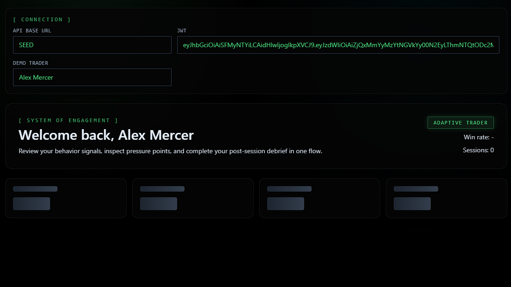
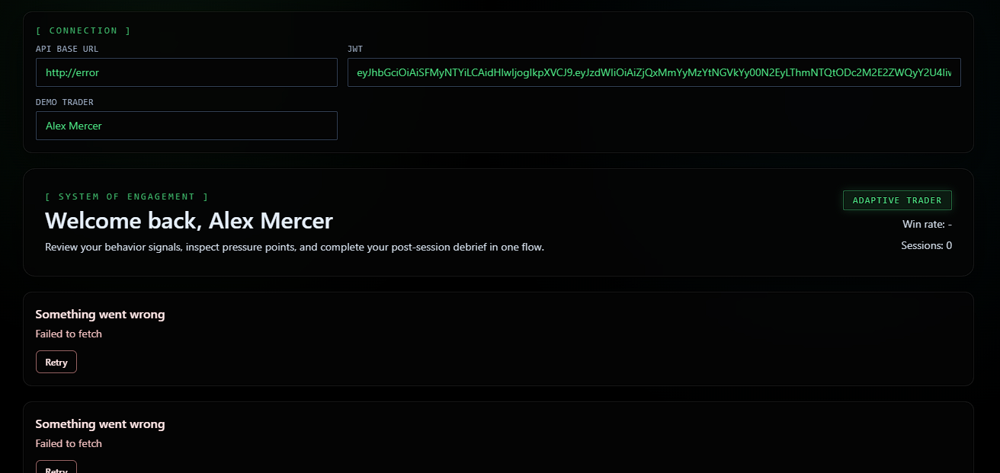
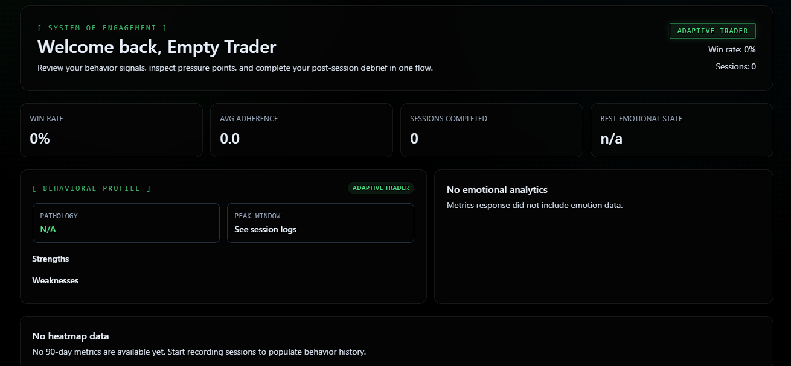

# NevUp Pulse Console - Track 3

Production-grade frontend for NevUp Hackathon 2026 Track 3 (System of Engagement).

## Stack

- Next.js 15 (App Router)
- TypeScript
- Tailwind CSS
- Framer Motion
- TanStack Query
- Zustand (persisted debrief state)
- Recharts (lazy-loaded)
- Custom SVG 90-day heatmap

## Core Features

- **Behavioral Analytics Dashboard:** Real-time metrics visualization and behavioral profiling.
- **5-Step Post-Session Debrief:** Animated flow with trade replay, emotional tagging, adherence rating, and AI coaching.
- **SEED Data Mode:** Permanent integration with the 388-trade dataset for high-fidelity demos.
- **Custom SVG Heatmap:** Hand-crafted 90-day trade quality visualization (no libraries).
- **Streaming AI Coaching:** SSE-powered token streaming with exponential backoff and simulation mode.
- **Full Keyboard Navigation:** Fully accessible flow using only keyboard inputs.

## Component States (Requirement #5)

As required by the hackathon specification, every data-fetching component supports explicit loading, error, and empty states. Below are the visual demonstrations of these states:

### 1. Loading State (Skeletons)
Demonstrates the UI while data is being fetched, using coordinated skeleton animations for the profile, heatmap, charts, and session lists.


### 2. Error State (Failed Fetch)
Demonstrates graceful degradation when the API is unreachable, providing a clear "Retry" action for the user.


### 3. Empty State (No Data)
Demonstrates the dashboard when a user has no trading history, providing helpful prompts instead of blank screens.


## Environment Variables

Create `.env.local`:

```bash
NEXT_PUBLIC_API_BASE_URL=http://localhost:4010
```

The app also supports base URL and JWT overrides from the dashboard controls.

## Run Locally

```bash
# Main stack (Frontend + Mock API)
docker compose up --build
```

Access the dashboard at: `http://localhost:4173/dashboard`

## Build / Start

```bash
npm run build
npm run start
```

## Lighthouse

```bash
npm run build
npm run lhci
```

Config: `lighthouserc.json`

## Screenshot Placeholders

- `docs/dashboard-desktop.png`
- `docs/dashboard-mobile.png`
- `docs/debrief-stepper.png`

## Architecture Notes

- `app/dashboard/page.tsx`: Main dashboard orchestration.
- `lib/seed.ts`: Local dataset parser for high-fidelity 388-trade simulation.
- `components/Heatmap.tsx`: Mandatory custom SVG heatmap implementation.
- `DECISIONS.md`: Architectural rationale and design choices.
